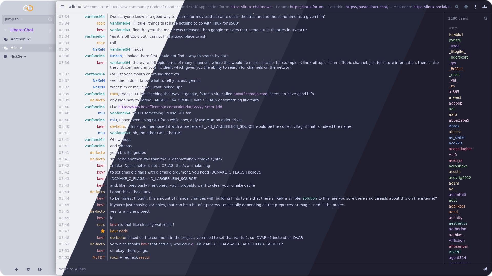
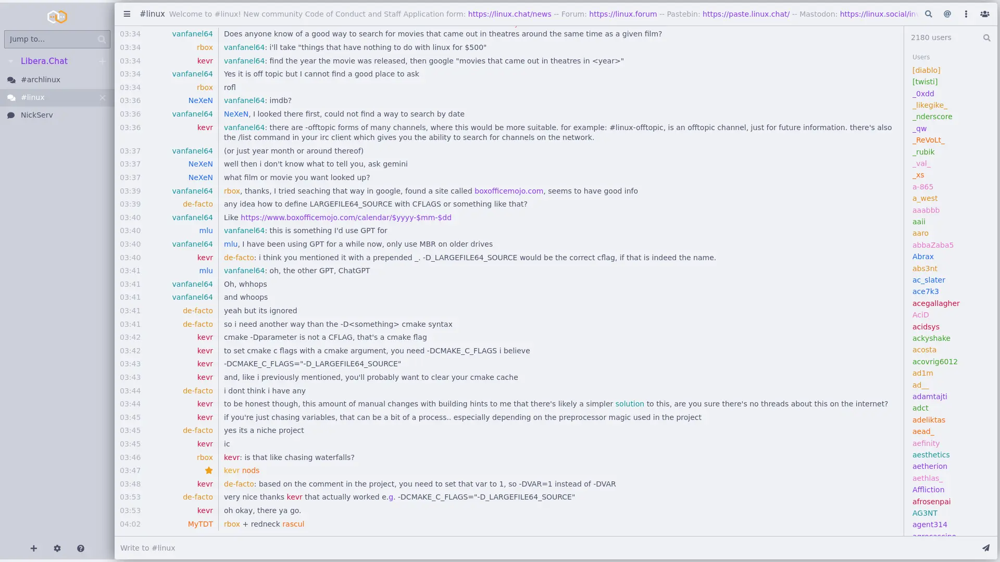
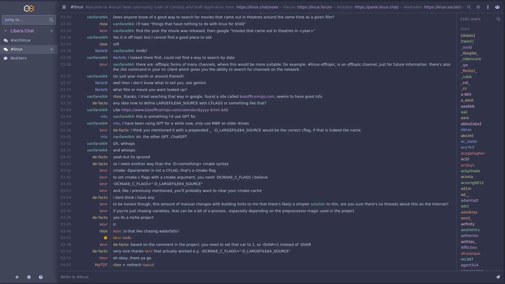
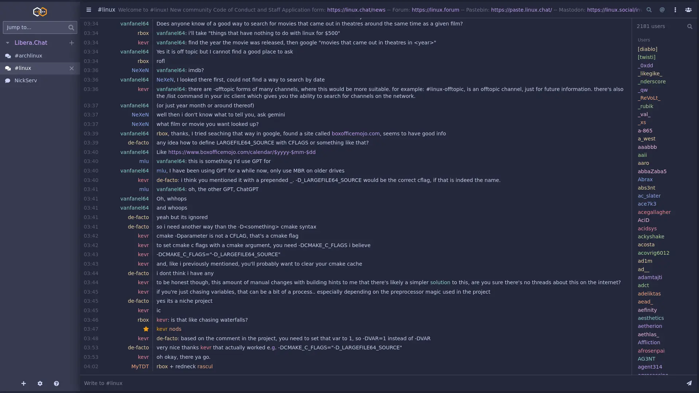
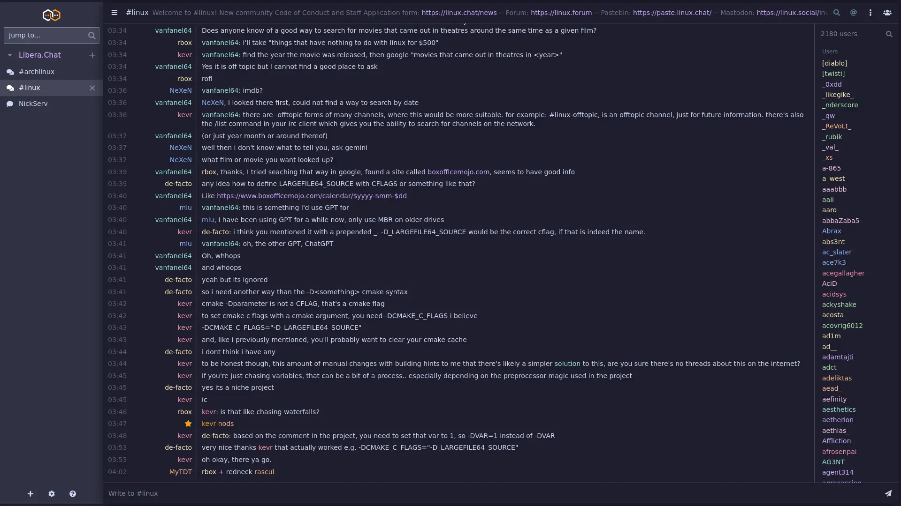

<h3 align="center">
	<br/>
	
	Catppuccin for <a href="https://thelounge.chat/">The Lounge</a>
	
</h3>

<p align="center">
	<a href="https://github.com/catppuccin/thelounge/stargazers"></a>
	<a href="https://github.com/catppuccin/thelounge/issues"></a>
	<a href="https://github.com/catppuccin/thelounge/contributors"></a>
</p>

<p align="center">
	
</p>

## Previews

<details>
<summary>🌻 Latte</summary>

</details>
<details>
<summary>🪴 Frappé</summary>

</details>
<details>
<summary>🌺 Macchiato</summary>

</details>
<details>
<summary>🌿 Mocha</summary>

</details>

## Installation

### Manually

1. Copy the contents of `theme.css` from your desired flavor in `themes/catppuccin-{flavor}/`
2. Paste it into your instance of `The Lounge` in Settings -> Appearance -> Custom Stylesheet

### thelounge install

1. Run `thelounge install @catppuccin/thelounge-theme-catppuccin-{flavor}` e.g.

```bash
thelounge install @catppuccin/thelounge-theme-catppuccin-mocha
```

2. Select the theme from your instance of `The Lounge` in Settings -> Appearance -> Theme

## 💝 Thanks to

- [hyperreal](https://github.com/hyperreal64)

&nbsp;

<p align="center">
	
</p>

<p align="center">
	Copyright &copy; 2021-present <a href="https://github.com/catppuccin" target="_blank">Catppuccin Org</a>
</p>

<p align="center">
	<a href="https://github.com/catppuccin/catppuccin/blob/main/LICENSE"></a>
</p>
